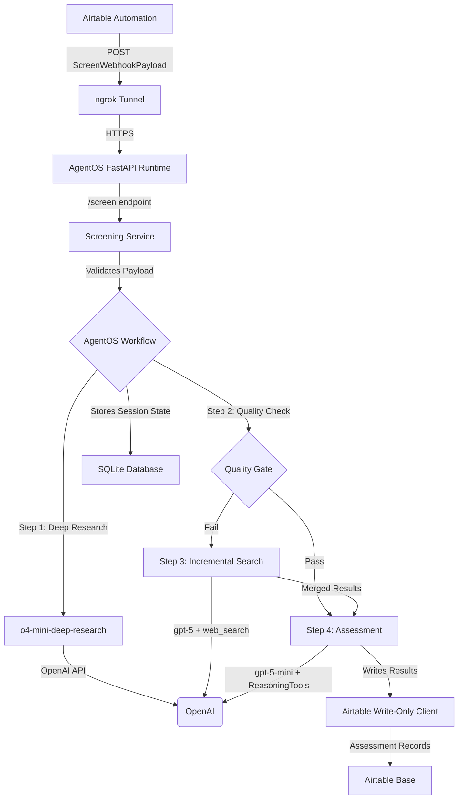

# Architecture

This document provides a high-level overview of the Talent Signal Agent's architecture.

## Architectural Diagram

## Components

The application is composed of several key components:

### Runtime Layer

-   **AgentOS FastAPI Runtime (`demo/agentos_app.py`):** The canonical webhook server built on FastAPI and AgentOS. Provides:
    -   `/screen` POST endpoint for Airtable webhooks (202 Accepted, background processing)
    -   `/healthz` GET endpoint for health checks
    -   AgentOS control plane UI for real-time workflow monitoring
    -   Session state persistence via SqliteDb
    -   Bearer token authentication (optional via `AGENTOS_SECURITY_KEY`)
    -   Structured logging with emoji indicators (🔍, ✅, ❌, 🔄)

-   **AgentOS (`agno.os.AgentOS`):** Production-ready runtime framework that provides:
    -   Workflow orchestration and session management
    -   Real-time monitoring dashboard at `https://os.agno.com`
    -   Session persistence to SQLite (local) or Postgres (production)
    -   Agent and workflow registration for observability

### Workflow Layer

-   **AgentOSCandidateWorkflow (`demo/workflow.py`):** AgentOS-aware workflow orchestration that defines and executes the 4-step screening pipeline:
    1.  **Deep Research:** `o4-mini-deep-research` performs comprehensive OSINT profiling (includes parser step to structure markdown)
    2.  **Quality Gate:** Heuristic check (≥3 citations + non-empty summary)
    3.  **Incremental Search (conditional):** `gpt-5` with web_search_preview if quality gate fails
    4.  **Assessment:** `gpt-5-mini` with ReasoningTools evaluates candidate against role spec
    -   Manages AgentOS session state and workflow registration
    -   Handles Pydantic model serialization for SqliteDb persistence

-   **Screening Service (`demo/screening_service.py`):** Shared orchestration logic that coordinates the end-to-end screening process:
    -   Payload validation and candidate extraction from webhook
    -   Batch candidate processing with error isolation
    -   Airtable status updates (Processing → Complete/Failed)
    -   Markdown report generation (assessment and research reports)
    -   Automation event logging for audit trails
    -   Delegates individual candidate workflow execution to `AgentOSCandidateWorkflow`

### Data Layer

-   **AirtableClient (`demo/airtable_client.py`):** Write-only client pattern:
    -   Zero traversal API calls - all data arrives via structured webhook payloads
    -   Airtable formulas handle all read operations and data assembly
    -   Python only writes: assessments, screen status updates, automation logs
    -   Pre-assembled payloads contain spec snapshots, candidate data, role info

-   **Pydantic Models (`demo/models.py`):** Structured data validation:
    -   `ScreenWebhookPayload`: Validates complete webhook payload structure
    -   `ExecutiveResearchResult`: Structured research output with citations
    -   `AssessmentResult`: Evidence-aware scoring with dimension-level details
    -   All models use `None` for unknown/missing data (never 0 or NaN)

-   **SQLite (via AgentOS SqliteDb):** Session state persistence:
    -   Location: `tmp/agno_sessions.db`
    -   Stores workflow execution state for audit trails
    -   Session ID format: `screen_{screen_id}_{candidate_id}`
    -   Enables workflow resumption and debugging via AgentOS UI

### Agent Layer

-   **Centralized Prompt Catalog (`demo/prompts/catalog.yaml`):** YAML-based prompt definitions:
    -   Code-free prompt iteration
    -   Evidence taxonomy: [FACT]/[OBSERVATION]/[HYPOTHESIS]
    -   Temporal awareness via `add_datetime_to_context=True`
    -   Dynamic placeholder support via `get_prompt(name, **placeholders)`

-   **Agent Factories (`demo/agents.py`):** Creates agents with prompts from catalog:
    -   Research agent: `o4-mini-deep-research` (no output_schema)
    -   Parser agent: `gpt-5-mini` (structured output)
    -   Incremental search: `gpt-5` (max 2 web searches)
    -   Assessment agent: `gpt-5-mini` + ReasoningTools

## Workflow Execution

The core logic follows a four-step linear workflow orchestrated by AgentOS:

1.  **Deep Research:** The Research Agent (`o4-mini-deep-research`) gathers comprehensive information about the candidate from public sources (LinkedIn, company sites, news articles, funding databases). Returns markdown report with citations.

2.  **Research Parser:** Structures the markdown research into `ExecutiveResearchResult` Pydantic model, extracting career timeline, key achievements, and evidence taxonomy.

3.  **Quality Gate:** Heuristic check (≥3 unique citations AND non-empty summary). If passed, proceed to assessment. If failed, trigger incremental search.

4.  **Incremental Search (Conditional):** Only runs if quality gate fails. Uses `gpt-5` with `web_search_preview` tool (max 2 searches) to fill specific gaps identified in initial research.

5.  **Assessment:** The Assessment Agent (`gpt-5-mini` + ReasoningTools) evaluates the candidate against the role specification. Produces evidence-aware dimension scores (1-5 scale, with `None` for unknown), overall score, confidence levels, and counterfactuals.

## Data Flow

**Request Flow:**
1. User sets Screen status to "Ready to Screen" (triggers Airtable automation)
2. Automation POSTs structured `ScreenWebhookPayload` to `/screen` endpoint
   - Payload contains `screen_slug` with nested objects: `role_spec_slug` (spec snapshot), `search_slug` (role info), `candidate_slugs[]` array
   - All data pre-assembled by Airtable formulas - zero API traversal needed
3. Python code sets status to "Processing" when workflow starts
4. FastAPI endpoint validates payload using `ScreenWebhookPayload` Pydantic model
5. `screening_service.process_screen_direct()` extracts spec markdown and candidates from payload
6. For each candidate: `AgentOSCandidateWorkflow.run_candidate_workflow()` executes 4-step pipeline
7. Assessment results written to Airtable `Platform-Assessments` table via write-only client
8. Screen status updated to "Complete"

**State Management:**
- Workflow state persisted in `tmp/agno_sessions.db` (SqliteDb)
- Session ID format: `screen_{screen_id}_{candidate_id}`
- State structure: `session_state["workflow_data"]` dict containing research, assessment, metadata
- Pydantic models serialized to dict for JSON persistence

## Directory Structure

The project is organized into the following main directories:

-   `demo/`: Contains the main application code
    -   `agentos_app.py`: AgentOS FastAPI runtime (canonical webhook server, ~318 lines)
    -   `workflow.py`: AgentOSCandidateWorkflow orchestration (~467 lines)
    -   `screening_service.py`: Shared workflow orchestration + report generation (~462 lines)
    -   `screening_helpers.py`: Business logic utilities (~427 lines)
    -   `agents.py`: Agent factories + execution runners (~864 lines)
    -   `airtable_client.py`: Write-only Airtable client (~290 lines)
    -   `models.py`: Pydantic models with structured payloads (~304 lines)
    -   `settings.py`: Environment configuration (~120 lines)
    -   `prompts/`: YAML catalog + loader
-   `tests/`: Contains the test suite (130 tests, 75% coverage)
-   `docs/`: Contains this documentation
-   `scripts/`: Contains utility scripts
-   `spec/`: Canonical specifications (`spec.md`, `prd.md`)

## Key Design Patterns

-   **Write-Only Airtable Pattern:** Zero traversal API calls - all data arrives via structured webhook payloads. Airtable formulas handle all reads and data assembly.

-   **Evidence-Aware Scoring:** Explicit `None` for unknown dimensions (not 0 or NaN). LLM self-assessment confidence levels (High/Medium/Low) per dimension.

-   **Quality-Gated Research:** Conditional incremental search only triggers when initial research fails quality threshold (≥3 citations + non-empty summary).

-   **Centralized Prompt Management:** YAML catalog enables code-free prompt iteration. All prompts loaded via `get_prompt()` function.

-   **Session State Persistence:** SqliteDb stores workflow execution state for audit trails and debugging via AgentOS UI.

## Report Generation

The system generates markdown reports for each candidate assessment:

-   **Assessment Reports:** Comprehensive markdown combining assessment results, research summary, dimension scores, and role spec snapshot. Generated by `screening_helpers.render_screen_report()` and written to `tmp/screen_reports/` directory.
-   **Research Reports:** Detailed research findings with citations and career timeline. Generated by `screening_service._build_research_report_content()`.
-   **Inline Markdown:** Concise summary for Airtable inline display. Generated by `screening_helpers.render_assessment_markdown_inline()`.

Reports are temporarily written to disk and uploaded as attachments to Airtable assessment records, then cleaned up after upload.

## API Endpoints

### POST /screen

Main webhook endpoint for Airtable automations. Accepts `ScreenWebhookPayload` and returns 202 Accepted immediately, processing candidates in the background.

**Authentication:** Optional bearer token (if `AGENTOS_SECURITY_KEY` is configured)

**Response:** `{"status": "accepted", "message": "Screen workflow started", "screen_id": "...", "candidates_queued": N}`

### GET /healthz

Simple health check endpoint for monitoring and smoke tests.

**Response:** `{"status": "ok"}`

## Related Documentation

-   **Detailed Architecture:** See `docs/technical/DESIGN_SYNTHESIS.md` for comprehensive architectural analysis
-   **Agent Definitions:** See `docs/technical/AGENT_DEFINITIONS.md` for agent specifications
-   **API Reference:** See `docs/how_it_works/user_guide.md` for complete API documentation
-   **Demo Setup:** See `docs/DEMO_RUNBOOK.md` for complete demo setup guide
-   **Technical Spec:** See `spec/spec.md` for canonical technical specification
